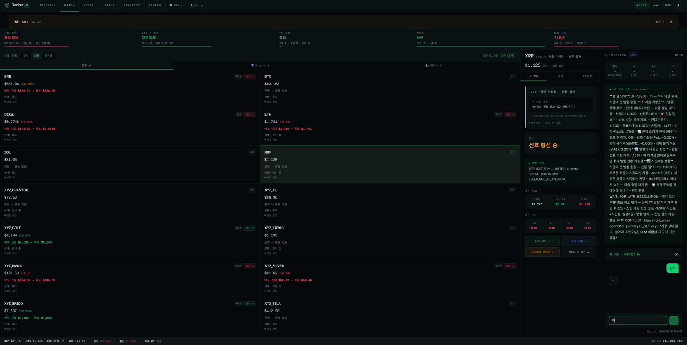
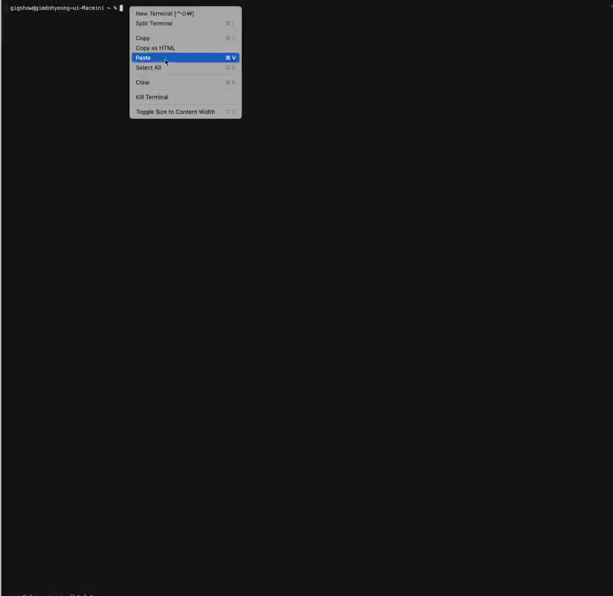
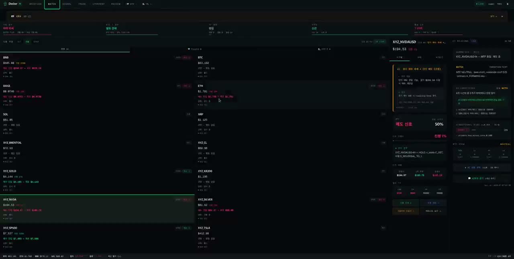
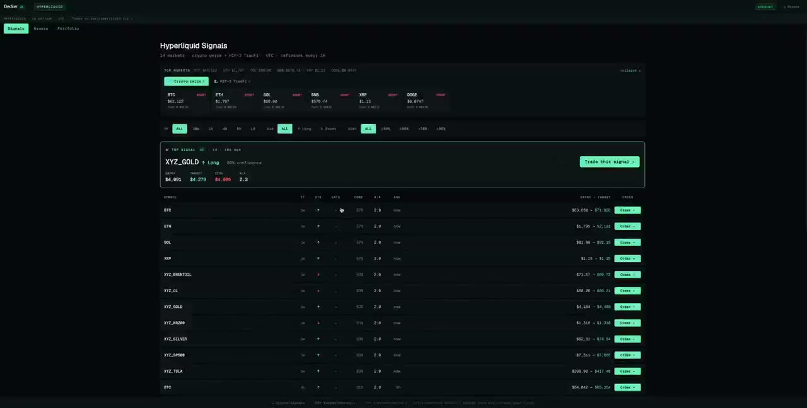
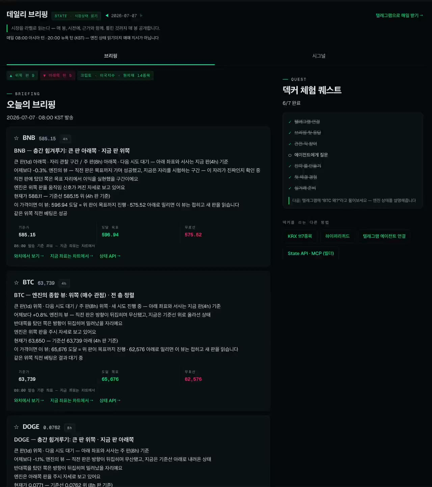
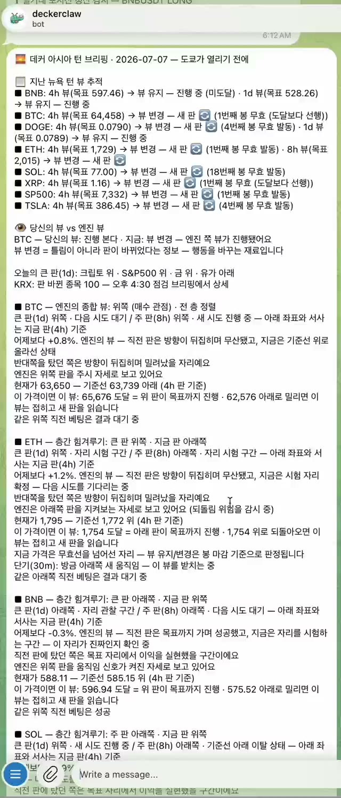
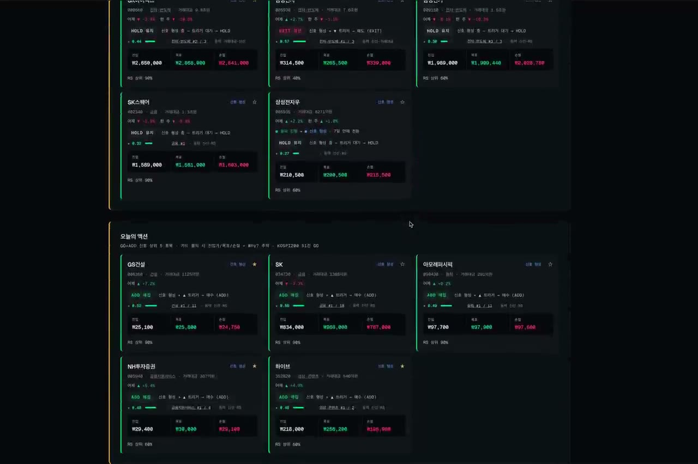

<!--
  Keywords: AI trading signal, crypto market state engine, structural analysis,
  algorithmic trading API, Telegram trading bot, Python SDK, decker-client,
  deterministic signal, progress_pct, operation rules, GO WATCH HOLD, KRX, KOSPI
-->
<div align="center">

<h1>&nbsp; Decker AI</h1>

### The deterministic market-state layer your trading agents call.

**Rules trade, LLMs explain.** Live, non-custodial, with receipts.

[Open the app](https://decker-ai.com) · [Telegram bot](https://t.me/deckerclawbot) · [Kakao channel](https://pf.kakao.com/_RxlxjVX) · [API docs](https://api.decker-ai.com/docs)

[](https://decker-ai.com)
[](https://t.me/deckerclawbot)
[](https://pf.kakao.com/_RxlxjVX)
[](https://api.decker-ai.com/docs)
[](https://api.decker-ai.com/api/v1/mcp/health)
[](LICENSE)



</div>

---

## What you get

- **Signals you can act on, with context.** Not "BUY" — `GO / WATCH / HOLD` + `progress_pct` (0–100% lifecycle) + entry / stop / target.
- **It explains itself.** Every signal has a structural cause (multi-timeframe alignment, state machine phase) that an LLM translates into plain language.
- **Same engine, two markets.** Crypto (24/7) + Korean equities (KOSPI + KOSDAQ, Beta).
- **Use it your way.** Web app, Telegram, Kakao channel, REST API, or MCP server inside Claude / Cursor.

> *"Where are we in the current structural cycle — and what's the next optimal move?"*

---

## Get started in 60 seconds

| Path | Best for | Start |
|------|---------|-------|
| 📱 **Web app** | Most people — full dashboard, mock trading, KRX watchlist | **[decker-ai.com](https://decker-ai.com)** — sign up free |
| 🤖 **Telegram bot** | Quick signal checks on your phone | **[@deckerclawbot](https://t.me/deckerclawbot)** — `/start` |
| 💛 **Kakao channel** | 한국 사용자, KRX 시그널 알림 | **[pf.kakao.com/_RxlxjVX](https://pf.kakao.com/_RxlxjVX)** |
| 🧠 **MCP server** | Claude / Cursor / Codex users | [DEVELOPER_README.md](DEVELOPER_README.md#mcp-server-way-e) |
| 🛠 **REST API** | Developers building bots & apps | [DEVELOPER_README.md](DEVELOPER_README.md#api-quickstart-3-steps) |

> Free tier is generous (30 calls/day on the API; Web + Telegram included). During Beta, signed-up users get **PRO access for free**.

---

## See it in action

**Start here — 30 seconds. No signup, no key.**

```bash
curl -s https://api.decker-ai.com/api/v1/public/demo | jq .
```

<a href="assets/video/decker-mcp-demo.mp4"></a>

▶️ **[Play — MCP demo (48s)](assets/video/decker-mcp-demo.mp4)** · Then one MCP line gives any agent the same read — **zero LLM in the signal path.**

### The engine room — live FSM, MTF alignment, R:R

<a href="assets/video/decker-webapp-dashboard.mp4"></a>

▶️ **[Play — the live cockpit (16s)](assets/video/decker-webapp-dashboard.mp4)** · Every signal traces to a structural cause: `progress_pct` + `operation_gate` + entry / stop / target.

### Signal → execution, non-custodial

<a href="assets/video/decker-hyperliquid-page.mp4"></a>

▶️ **[Play — non-custodial execution (16s)](assets/video/decker-hyperliquid-page.mp4)** · Click Order · wallet-sign · **custody 0**. Decker relays your signature only (revocable agent wallet, EIP-712). *For information only — not investment advice.*

### Read it daily — and we score our own calls

<a href="assets/video/decker-daily-briefing.mp4"></a>
<a href="assets/video/decker-telegram-briefing.mp4"></a>

▶️ **Play:** [web hub (10s)](assets/video/decker-daily-briefing.mp4) · [Telegram (6s)](assets/video/decker-telegram-briefing.mp4)

Every morning (08:00 KST): the engine's view per symbol — baseline, what winning and losing look like, and a pick you can answer. Evening: the **same view scored against what actually happened — hits and misses alike, on the record.** *We stamp our wrong calls too.*

Web hub: [decker-ai.com/briefing](https://decker-ai.com/briefing) · Subscribe: [@deckerclawbot](https://t.me/deckerclawbot) → `/briefing`

### Korean equities (KRX) — Beta, free

<a href="assets/video/decker-krx-page.mp4"></a>

▶️ **[Play — KRX (16s)](assets/video/decker-krx-page.mp4)** · Same deterministic engine on KOSPI + KOSDAQ. Portfolio states — **ADD / HOLD / REDUCE / EXIT**, not buy/sell. Daily closing-bell checkup at 16:30 KST · [@krxdeckerbot](https://t.me/krxdeckerbot).

---

## Three things that make it different

**1. `progress_pct` — every signal has a lifecycle.**
A signal at 25% progress is a different trade than the same signal at 80%. Most tools just say "BUY"; Decker tells you *where in the move you are*.

```
Entry                                                           Target
  0%──────────33%──────────50%──────────67%──────────83%────────100%
 Wait       Entry        Active       Late TP      Final TP     Exit
```

**2. `GO / WATCH / HOLD` — three gates, not binary.**
| Gate | Meaning |
|------|---------|
| **GO** | Structure confirmed — entry conditions met |
| **WATCH** | Signal forming — monitor, no entry yet |
| **HOLD** | Active position — no new entry signal |

> `WATCH` is the gate most tools skip. It's why users enter too early.

**3. Deterministic + traceable. LLM explains, doesn't decide.**
| | Typical AI signal | Decker |
|---|---|---|
| Source | ML / LLM price prediction | Deterministic state machine |
| Output | BUY / SELL | `progress_pct` + `operation_gate` + ranked choices |
| LLM role | Makes the call | **Explains the structural state** |
| Auditability | ❌ Black box | ✅ Every signal has a `trace_id` |
| Cost per signal | High | **$0 on the rules path** |
| Reproducibility | ❌ | ✅ Same input → same output, always |

---

## Pricing

| Tier | Price | Daily API limit | MCP | Auto-trade |
|------|-------|-----------------|-----|------------|
| **FREE** | $0 forever | 30 calls/day | read-only (1d cache) | ❌ |
| **PRO** | $20 / mo · 7-day trial | 10,000 / day | full (7 tools) | virtual + real |
| **ENTERPRISE** | Contact us | 100,000+ / day · custom | full + per-org skill catalog | + custom integration |

> **Beta (now):** all authenticated users get **PRO for free** via `BETA_TIER_OVERRIDE=PRO`. No payment required.

Web sign-up and Telegram bot are always free for the basics.

---

## For developers

Building a bot, app, or agent on top of Decker? Everything you need — REST endpoints, MCP server (Claude / Cursor / Codex), Python SDK, OpenClaw skill, self-host — lives in one place:

### → **[DEVELOPER_README.md](DEVELOPER_README.md)**

```bash
# 60-second smoke test (no auth needed)
curl https://api.decker-ai.com/api/v1/public/demo
```

```bash
# With an API key (decker-ai.com → Settings → API Keys, or Telegram /apikey)
curl "https://api.decker-ai.com/api/v1/public/signals/BTCUSDT/latest?timeframe=1h" \
  -H "X-API-Key: dk_live_xxx"
```

**Prefer a runnable file?** → [`examples/quickstart.py`](examples/quickstart.py) — zero dependencies (stdlib only), no key, prints the composed view + receipts in one run. Wrapping Decker for an agent crew: [`examples/langgraph_decker_tool.py`](examples/langgraph_decker_tool.py). More in [`examples/`](examples/).

The demo returns the **composed view** — the same card our daily briefing sends:

```json
{ "layer": "STATE_VIEW", "symbol": "BTCUSDT", "ref_price": 63650.0,
  "lines": ["■ BTC — 층간 힘겨루기: 주 판 아래쪽 · 지금 판 위쪽", "…"],
  "wait_target": "...", "invalidation": "...",
  "verdict_recent": [{"briefing_date": "2026-07-05", "slot": "morning", "verdict": "hit"}],
  "provenance": { "composer": "briefing_story.compose_card" } }
```

**Add to Claude Desktop / Cursor (MCP):**

```json
{
  "mcpServers": {
    "decker-ai": {
      "url": "https://api.decker-ai.com/api/v1/mcp/sse",
      "headers": { "X-API-Key": "dk_live_xxx" }
    }
  }
}
```

Full guide → **[DEVELOPER_README.md](DEVELOPER_README.md)** (endpoints · auth · rate limits · MCP 7 tools · SDK · OpenClaw · self-host).

**Running a multi-agent crew** (TradingAgents / LangGraph / AutoGen)? Give your analysts one deterministic market-state instrument — with receipts — instead of re-deriving structure per prompt: → **[docs/integrations/multi-agent-frameworks.md](docs/integrations/multi-agent-frameworks.md)**

---

## How the engine works (one diagram)

```
Raw OHLCV candles
  ↓  Sequence Labeler  →  every candle gets a role (anchor / test / signal)
  ↓  State Machine     →  C_SET → B_FORMING → B_SET → A_FORMING → W_PENDING
  ↓  Operation Gate    →  GO · WATCH · HOLD
  ↓  RULES Engine      →  9-layer YAML rulebook → strategy + ranked choices
  ↓  AI Consultation   →  LLM translates structural state → plain language
  ↓
"67% progress. B-leg confirmed. Recommended: 30% partial TP or hold to target."
```

**No price prediction. No black box. Every output traces to a formal structural cause.**

Deep dives: [Sequence Engine](concept/sequence_engine.md) · [Labeling Algorithm](concept/labeling_algorithm.md) · [Market State Theory](concept/market_state_theory.md)

---

## Supported symbols

**Crypto (GA):** `BTCUSDT` · `ETHUSDT` · `SOLUSDT` · `BNBUSDT` · `XRPUSDT` · `DOGEUSDT` — timeframes `30m`, `1h`, `4h`, `1d`.

**KRX (Beta, free):** KOSPI 948 + KOSDAQ 1,822 = **2,770 tickers**. Universe = top 200 by trading value ∪ user watchlist ∪ momentum spike ∪ volume spike. Timeframe `1d` only (1w expanding). Daily evaluation at 16:30 KST.

KRX details: [`docs/krx/KRX_BUSINESS_MODEL_AND_ROADMAP_2026-05-09.md`](docs/krx/KRX_BUSINESS_MODEL_AND_ROADMAP_2026-05-09.md).

---

## Performance

We don't publish a headline win rate. Backtest numbers without method
and sample size are marketing, not evidence — and easy to cherry-pick.

What we stand on instead:

- **Deterministic & reproducible.** Same input → same output, always.
  The rules path has zero LLM in it, so a signal is not a model's opinion —
  it's a formal structural verdict you can re-derive.
- **Auditable.** Every read carries its `provenance` (composer + the versioned
  rulebook contract) and traces back to the exact engine emit. The full
  RULES.yaml is open, so you can re-derive any verdict yourself.
- **Scored in public, daily.** The morning briefing's view is graded against
  what actually happened that evening — hits and misses alike, on the record.
  → [decker-ai.com/briefing](https://decker-ai.com/briefing)

Method and rulebook are open: [Model & Algorithm](docs/model.md) · [Operation Rules (YAML)](operation_rules/RULES.yaml) · [Signal Performance](docs/signal-performance.md).

*For information only. Not investment advice.*

---

## Docs

| | |
|--|--|
| **[DEVELOPER_README.md](DEVELOPER_README.md)** | API · MCP · SDK · OpenClaw · self-host — **start here if you're building** |
| [Developer API Guide](docs/DEVELOPER_API_GUIDE.md) | Auth · rate limits · FAQ (long form) |
| [Architecture](docs/architecture.md) | Pipeline, state engine, modules |
| [Model & Algorithm](docs/model.md) | How the signal engine works |
| [Operation Rules](operation_rules/RULES.yaml) | Open YAML rulebook (v2.4.7+) |
| [Article Series (1–15)](docs/medium/README.md) | Deep dives on Medium |
| [Roadmap](docs/roadmap.md) | What's next |
| [llms.txt](llms.txt) | LLM / AI agent discovery manifest |

---

## Links

| | |
|-|-|
| **Web app** | https://decker-ai.com |
| **API docs** | https://api.decker-ai.com/docs |
| **Telegram bot (crypto)** | https://t.me/deckerclawbot |
| **Telegram bot (KRX)** | https://t.me/krxdeckerbot |
| **Kakao channel** | https://pf.kakao.com/_RxlxjVX |
| **X / Twitter** | https://x.com/blockoceandev |

---

> This repository is the **public hub** for Decker AI — SDK, samples, rulebook, architecture docs, OpenClaw skill packages.
> Production application code runs in a private monorepo. All listed endpoints, channels, and the web app are live.
>
> Built by **[gigshow](https://github.com/gigshow)** (Dohyung Kim · 김도형) — founder. *Open to investor / partnership conversations.*
